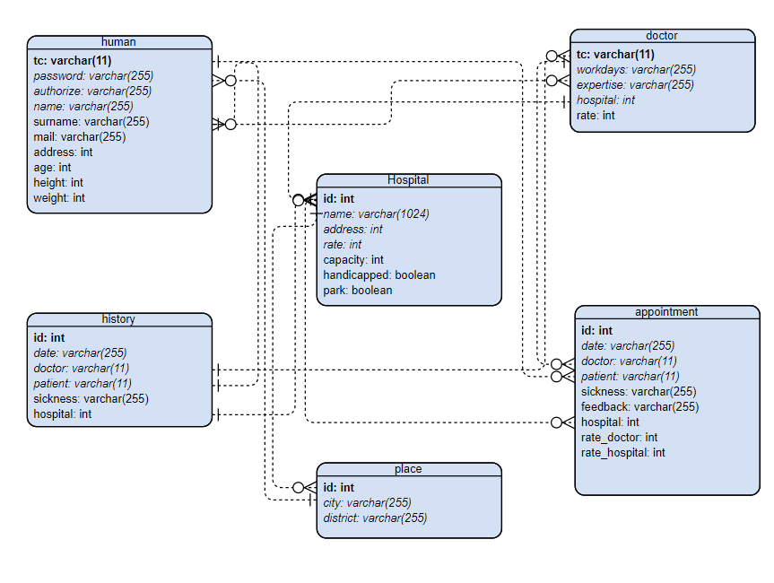

Developer Guide
===============
some text
Database Design
---------------

Code implemented by Furkan
--------------------------

.. code-block:: python
    :linenos:

        def add_hospital(name: str = None, city: str = None, district: str = None, park: bool = False,
                     handicapped: bool = True) -> str:
        try:
            with dbapi2.connect(db_url) as connection:
                with connection.cursor() as cursor:

                    address = get_address_id(cursor, city, district)

                    add_statement = "INSERT INTO hospital(name, address,park,handicapped) " \
                                    "VALUES('{}',{},'{}','{}');".format(name, address, park, handicapped)

                    cursor.execute(add_statement)
                    return "Succesfull"

        except (Exception, dbapi2.Error) as error:
            print("Error while connecting to PostgreSQL: {}".format(error), file=sys.stderr)
            return str(error)

        finally:
            if connection:
                cursor.close()
                connection.close()

add_hospital function called when add hospital button is clicked in admin_hospital.html file. This function takes all features that can not be NULL and creates a hospital.

Code implemented by Emre
-------------------------

.. code-block:: python
	:linenos:

	def add_person():
	name = request.form.get("name")
	surname = request.form.get("surname")
	tc = request.form.get("tc")
	email = request.form.get("email")
	address = request.form.get("address")
	password = request.form.get("password")
	authorization = request.form.get("authorization")
	human_for_check = Human(tc=tc).get_object()
	if human_for_check is None:
		human = Human(tc=tc, password=password, authorize=authorization, name=name, surname=surname, mail=email,
					  address=address)
		human.save()

	return redirect(url_for('login_page'))

Since doctors are first needed to be created as human class, first add_human function called in order to create a human.

.. code-block:: python
	:linenos:

	def add_human(human_id, workdays, expertise, hospital_id):
    try:
        with dbapi2.connect(db_url) as connection:
            with connection.cursor() as cursor:
                print("yeni doktordayız")
                statement = "insert into doctor(human, workdays, expertise, hospital)"\
                "values('{}','{}','{}','{}');".format(human_id, workdays, expertise, hospital_id)
                cursor.execute(statement)
                return "successful"

    finally:
        if connection:
            cursor.close()
            connection.close()
			
Then add_human function is called from the information obtained from add_human function.

.. code-block:: python

      class Foo:

         def __init__(self, x):
            self.x = x

.. toctree::

	developer/member1
	developer/member2

