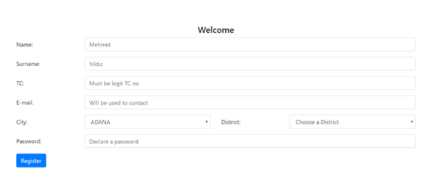
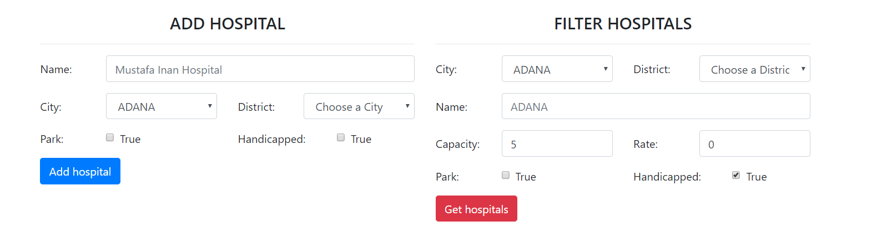

User Guide
==========

MedCheck is a site that especially designed to bring patients and hospitals together and help both sides. Instead of going to hospital, patients can sign up and fill their profile. Then they can easily have a appointment.

There are 2 user types. Doctor and patient. They can both register to the system using sign up page and update their profiles whenever they want.

Patient Guide
--------------
This page shows how to use application based on users perspective.

This page welcomes new users. These information are needed to create a patient and none of them can be left empty.

.. figure:: sign_in.PNG
    :scale: 100%
    :alt: Time to log in to the system

After you successfully register to the system you can now log in with the information you just provided.

.. figure:: take_app.PNG
    :scale: 100%
    :alt: Make an appointment

Finally you can make an appointment. Here information you entered does not have to be same with the information you provided while signing into the system. Meaning that you may live in Uskudar but you can make reservation to hospital in Kadikoy. Important thing in here is you should be careful about your appointment date. Since this platforms makes it easy to make appointment, not being present at the appointment time will impact negatively your future appointment requests.

Doctor Guide
--------------
This page shows how to use the application with the authority of doctors.

Registration of doctors are made by admins. So doctors can update their profile and see their upcoming appointments.

.. figure:: doctor.PNG
    :scale: 100%
    :alt: Appointment list

Here in this page doctors can check their upcoming appointments.

Admin Guide
--------------

Admins can add new doctors and hospitals.

.. figure:: admin1.PNG
    :scale: 100%
    :alt: admin1

Admins can add places by adding .csv file. On the right side places can be filtered by given constraints.

Admins can add hospitals. On the right side hospitals can be filtered by given constraints.

.. figure::admin3.PNG
    :scale: 100%
    :alt: admin3

Here admins can add doctors and filter them by given constraints.

